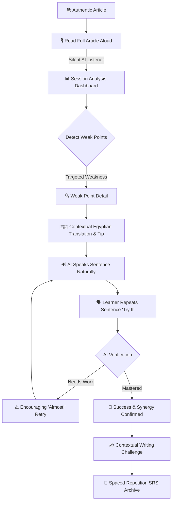

<p align="center">
  
</p>

<h1 align="center">Fluento (فلوينتو)</h1>

<p align="center">
  <strong>Next-Generation English Acquisition Powered by Long-Form Reading & Adaptive AI Speech Repair</strong>
</p>

<p align="center">
  <a href="#-features"></a>
  <a href="#-tech-stack"></a>
  <a href="#-architecture"></a>
  <a href="#-cefr-adaptive-framework"></a>
  <a href="#-quality-assurance"></a>
  <a href="LICENSE"></a>
</p>

<p align="center">
  <a href="#-the-core-concept">Core Concept</a> •
  <a href="#-learning-loop-flow">Learning Loop</a> •
  <a href="#-cefr-adaptive-framework">CEFR Engine</a> •
  <a href="#-design-system">Design System</a> •
  <a href="#-architecture--structure">Architecture</a> •
  <a href="#-getting-started">Getting Started</a> •
  <a href="#-roadmap">Roadmap</a>
</p>

---

## 📖 The Core Concept

Traditional language apps fragment learning into isolated, short flashcard drills or disjointed sentence-by-sentence repetitions. **Fluento redefines language acquisition**:

1. **Natural Long-Form Reading First:** The learner reads an entire authentic article naturally from start to finish without red error banners, robotic interruptions, or artificial pauses.
2. **Silent AI Evaluation:** While reading aloud, the AI engine listens in the background, computing words per minute (WPM), reading accuracy, fluency, linking, sentence stress, and phonemic precision.
3. **Adaptive Repair Loop:** Post-reading, the AI pinpoints the most critical pronunciation weak points calibrated to the user's CEFR level, explains them with natural **Egyptian Arabic** context, models the full sentence via natural Text-to-Speech (TTS), and guides the learner through repetition and verification.
4. **Contextual Writing Challenge:** Extracted directly from the article's core ideas, reinforcing active vocabulary through AI grammar and structure feedback.

> **Read → Analyze → Detect Weak Points → Explain → Listen → Repeat → Verify → Master → Continue**

---

## 🔄 Learning Loop Flow



---

## 🎯 CEFR Adaptive Framework (A1 – C1)

Fluento’s AI does not treat a beginner like an advanced speaker. Feedback severity, phonetic granularity, and explanations adapt dynamically:

| Level | Focus Criteria | Evaluated Weak Points | AI Personality & Feedback Style |
| :--- | :--- | :--- | :--- |
| **A1** *(Beginner)* | Intelligibility & skipped words | Major sound substitutions (e.g., `/θ/` vs `/s/`), dropped words | Ultra-encouraging, gentle, 100% Arabic explanation, zero jargon |
| **A2** *(Elementary)* | Word stress & basic rhythm | Multisyllabic stress (`de-VEL-op-ment`), common clusters | Supportive, focused on basic rhythm, clear Arabic tips |
| **B1** *(Intermediate)* | Sounds, pacing & sentence stress | Unstressed words, sentence stress, pacing, pause control | Analytical, constructive, bilingual explanation |
| **B2** *(Upper Int.)* | Connected speech & reductions | Linking (`is everywhere` → `iz-everywhere`), contractions, reductions | Professional, precise, highlighting natural native flow |
| **C1** *(Advanced)* | Prosody, nuance & cadence | Expressive intonation, implicit emphasis, subtle cadence | Demanding, native-standard, deep stylistic feedback |

---

## 📱 Application Screens & Features

<table>
  <tr>
    <td width="50%">
      <h3>1. Onboarding & Level Placement</h3>
      <ul>
        <li>Interactive welcoming experience with editorial typography.</li>
        <li>Self-guided CEFR level selection (A1 through C1).</li>
        <li>Multi-goal customization (Speaking, Pronunciation, Fluency, Writing).</li>
      </ul>
    </td>
    <td width="50%">
      <h3>2. Personalized Home Dashboard</h3>
      <ul>
        <li>Real-time progress overview: Articles completed, reading time, accuracy rate, words mastered.</li>
        <li>One-tap "Continue Reading" with personalized article recommendations.</li>
      </ul>
    </td>
  </tr>
  <tr>
    <td width="50%">
      <h3>3. Curated Article Library</h3>
      <ul>
        <li>Diverse categories: <i>Technology, Science, Business, Health, Travel, Society, Environment, Culture, Daily Life</i>.</li>
        <li>Search & multi-filter by CEFR level, estimated read time, and difficulty.</li>
      </ul>
    </td>
    <td width="50%">
      <h3>4. Distraction-Free Article Reader</h3>
      <ul>
        <li>Clean, high-legibility typography designed for sustained reading.</li>
        <li>Seamless transition to live reading aloud mode with timer and non-intrusive indicator.</li>
      </ul>
    </td>
  </tr>
  <tr>
    <td width="50%">
      <h3>5. AI Speech Repair Loop</h3>
      <ul>
        <li>Full score summary: Overall, Accuracy, Pronunciation, Fluency, WPM.</li>
        <li>Pronunciation cards highlighting focus words.</li>
        <li>Audio playback of entire sentences (not isolated words).</li>
        <li>Simulated recording & verification with realistic state handling.</li>
      </ul>
    </td>
    <td width="50%">
      <h3>6. Contextual Writing Workshop</h3>
      <ul>
        <li>Prompts grounded in the read article.</li>
        <li>Live interactive text editor with real-time word counter.</li>
        <li>Structured AI feedback across Grammar, Vocabulary, Spelling, Sentence Structure, and Clarity.</li>
      </ul>
    </td>
  </tr>
</table>

---

## 🎨 Design System & Palette

Fluento utilizes an organic, premium editorial palette inspired by classical literature, warm parchment paper, and modern minimalist interfaces.

<div align="center">

| Color | Hex | Swatch | Application |
| :--- | :---: | :---: | :--- |
| **Primary Forest** | `#2D6A4F` |  | Primary buttons, brand identity, active tabs |
| **Accent Gold** | `#E9B949` |  | Weak point focus markers, badges, stars |
| **Warm Paper** | `#FDF8F0` |  | Eye-friendly light scaffold background |
| **Night Slate** | `#1A1A2E` |  | Immersive dark mode background |
| **Success Emerald** | `#40916C` |  | Pronunciation mastery, high accuracy |
| **Soft Coral** | `#E07A5F` |  | Recording state, retry triggers |

</div>

### Typography
- **Headings & Display:** `Fraunces` (Google Fonts) — Editorial, authoritative serif.
- **Body, UI & Labels:** `Figtree` (Google Fonts) — Clean, ergonomic geometric sans-serif.

---

## 🏛️ Architecture & Clean Structure

The project follows clean architecture principles with distinct boundaries between presentation, domain models, data layers, and state providers.

```
lib/
├── main.dart                          # Application entry point with Provider tree
├── app.dart                           # FluentoApp MaterialApp configuration & routing
│
├── theme/                             # Design System & Styling
│   ├── app_colors.dart                # Light and Dark design tokens
│   └── app_theme.dart                 # Material 3 ThemeData with Fraunces & Figtree
│
├── models/                            # Domain Entities (Const & Serializable)
│   ├── article.dart                   # Article model with computed paragraph accessors
│   ├── cefr_level.dart                # CEFR Level enum (A1-C1) + title/description extensions
│   ├── pronunciation_feedback.dart    # PronunciationPoint & ReadingResult models
│   ├── user_profile.dart              # User profile stats & copyWith support
│   ├── vocabulary.dart                # VocabularyWord with IPA & Arabic translation
│   └── writing_task.dart              # WritingTask, WritingFeedback & WritingCorrection
│
├── data/                              # Sample Data & Mock Datasets
│   ├── sample_articles.dart           # Authentic articles across categories & CEFR levels
│   ├── sample_feedback.dart           # Realistic pronunciation points & level filtering
│   ├── sample_vocabulary.dart         # Article-extracted vocabulary bank
│   └── sample_writing.dart            # Contextual writing prompts & sample evaluations
│
├── providers/                         # State Management Layer (ChangeNotifier)
│   └── app_state.dart                 # Central application state & reactive notifications
│
├── widgets/                           # Reusable Component Library
│   ├── article_card.dart              # Polymorphic article card
│   ├── level_badge.dart               # CEFR pill badge
│   ├── mic_button.dart                # Pulsing interactive recording action button
│   ├── audio_player_widget.dart       # TTS listening player
│   ├── pronunciation_card.dart        # Weak point preview card
│   ├── recording_indicator.dart       # Silent session status indicator
│   ├── stat_card.dart                 # Dashboard stat display card
│   ├── feedback_bubble.dart           # AI tutor bubble
│   └── progress_bar_widget.dart       # Custom animated skill bar
│
└── screens/                           # Presentation Screens
    ├── main_shell.dart                # Bottom navigation bar with IndexedStack
    ├── onboarding/                    # Welcome, Level Selection & Goals screens
    ├── home/                          # Main personalized dashboard
    ├── articles/                      # Library, Reader, Live Session & Results
    ├── practice/                      # Repair loop & Completion screens
    ├── writing/                       # Prompt, Editor & AI Feedback screens
    ├── vocabulary/                    # Vocabulary bank with search & TTS
    ├── progress/                      # Skill breakdown & AI Demanding Level
    └── profile/                       # User settings, Level change & Dark Mode toggle
```

---

## ⚡ Getting Started

### Prerequisites
- **Flutter SDK:** Version `^3.13.4` or newer (Tested on Flutter `3.47.5`).
- **Dart SDK:** Version `^3.0.0`.
- **Android Studio / VS Code:** with Flutter & Dart extensions installed.
- **Physical Device or Emulator:** Android API 26+ or iOS 13+.

### Step-by-Step Installation

1. **Clone the repository:**
   ```bash
   git clone https://github.com/your-username/fluento.git
   cd fluento
   ```

2. **Set up Environment Variables:**
   ```bash
   cp .env.example .env
   ```
   *Edit `.env` to supply optional API keys for speech or LLM services.*

3. **Install dependencies:**
   ```bash
   flutter pub get
   ```

4. **Verify project health:**
   ```bash
   flutter analyze
   ```

5. **Run test suite:**
   ```bash
   flutter test
   ```

6. **Launch on connected device:**
   ```bash
   flutter run
   ```

---

## 🧪 Quality Assurance & Testing

All widget builders, state providers, and theme fonts are backed by automated tests:

```bash
# Run all unit and widget tests
flutter test

# Run tests with coverage output
flutter test --coverage
```

Current test coverage verifies:
- `AppTheme.lightTheme()` text styles and font sizes evaluate to expected `double` values.
- `AppTheme.darkTheme()` text styles and button font sizes evaluate to expected `double` values.
- `FluentoApp` boots, inflates widgets, and renders without runtime exceptions.

---

## 🗺️ Engineering Roadmap

- [x] **Phase 0 — Stability & Crash Elimination:** Resolved dynamic `fontSize` type mismatches in `app_theme.dart`. Added comprehensive widget tests.
- [ ] **Phase 1 — Local Persistence:** Integration of `shared_preferences` for settings and local SQLite/Drift database for reading history, vocabulary bank, and writing submissions. Split monolithic state into modular providers.
- [ ] **Phase 2 — Live Speech-to-Text Analysis:** Implementation of `SpeechAnalyzer` abstraction with on-device `speech_to_text`, text alignment, and WPM/accuracy calculators with privacy notices.
- [ ] **Phase 3 — LLM Writing Assessment:** Integration of `WritingFeedbackService` with structured JSON output and Egyptian Arabic explanations.
- [ ] **Phase 4 — Spaced Repetition System (SRS):** SM-2 review scheduler for weak-point sentences and vocabulary words with home dashboard daily review cards.
- [ ] **Phase 5 — Reader Ergonomics & Placement Test:** Tap-to-define in article reader, quick 2-minute placement quiz, and local daily notification reminders.
- [ ] **Phase 6 — Cloud Sync & Neural TTS:** Offline article caching repository and multi-provider neural audio synthesis abstraction.
- [ ] **Phase 7 — Global Localization:** Full Arabic and English dual-locale support (`flutter_localizations` with `.arb` catalogs).

---

## 🔐 Security & Secrets Best Practices

- **Zero Hardcoded Secrets:** All API keys and endpoints are consumed via environment files or secure storage.
- **Strict `.gitignore`:** Configured to block `.env`, `.keystore`, `.jks`, `.p12`, `google-services.json`, debug builds (`*.apk`, `*.aab`), and heavy recording dumps (>100MB).
- **Offline First:** Learner voice sessions are evaluated without third-party tracking or unauthorized telemetry.

---

<p align="center">
  <sub>Built with ❤️ for curious English learners worldwide.</sub>
</p>
